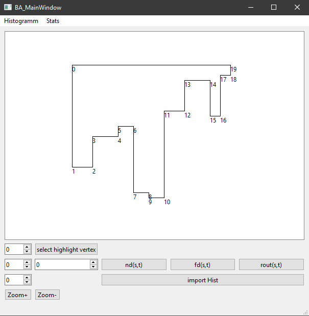

# Histogram_Bach_Arb

This Program was written for my bachelor thesis in computer science.
It implements a routing scheme for simple histograms.
Simple histograms are polygons, that can be converted into general graphs.
Only a subset of all graphs can be converted to histograms.
It is written in C++, files from generated [Documentation](https://faha132.github.io/histogram_bach_arb_github/) are also included.

## Authors and acknowledgment
Based on the PHD thesis of Max Willert.
["algorithm_description/Publikation_Willert.pdf"](https://github.com/faha132/histogram_bach_arb_github/blob/main/algorithm_description/Publikation_Willert.pdf) pages 21 - 31.

## License
GPL(v3), due to QT being available with GPLv3 License,
the programm has to be published with GPLv3 as well.

## Project status
finished

## Compiling for Windows users

Download the QT-Framework, select MinGW and QT-Creator packages for installation.
Also download the Boost Library and change the path in CMakefile.txt.
Start QT-Creator and open the project, then press the compile button.
If there are errors, with the newest version of the framework. Make sure to install any optional
Windows Updates.

## Running the programm

The Program can be run from QT-Creator.
There is a user manual, in german, in ["algorithm_description/ba_ausarbeitung.pdf"](https://github.com/faha132/histogram_bach_arb_github/blob/main/algorithm_description/ba_ausarbeitung.pdf), pages 10-13.
When running the programm, selecting the "gen_data" option, will take some time,
during which the programm is not responsonding.
